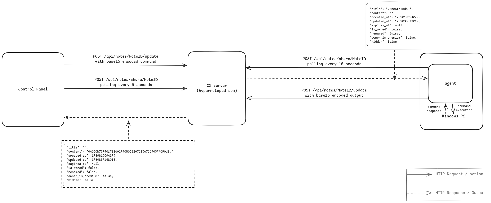

# LoTC-Notepad
## A lightweight Living off the Cloud Command & Control (C2) implementation

> A small proof of concept implementation that uses a cloud-hosted
> note service as a communication channel between an operator and an agent.


## Overview
LotC-Notepad demonstrates a C2 architecture where a cloud based note-taking service is used as the communication channel instead of a dedicated C2 server.

The project consists of two components:

- **Agent** - runs on the victim system and polls the cloud service for commands.
- **Operator Panel** - sends commands and retrieves command output.

Communication between the components is performed through encoded note content.

## Architecture


## Build
### Requirements:
- Go
- Make

### Build both components:
```
make build
```
### Build windows agent:
```
make build-agent
```
### Build linux operator component:
```
make build-server
```
### Clean build artifacts:
```
make clean
```

## Protocol

The protocol uses the following message formats:

```text
v91:<command>
v92:<response>
```

## Disclaimer

For educational and security research purposes only.
Use only in authorized environments.
